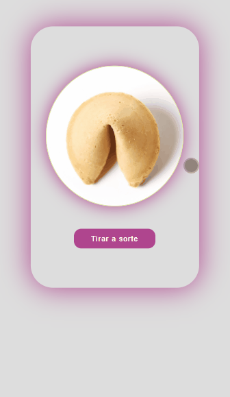
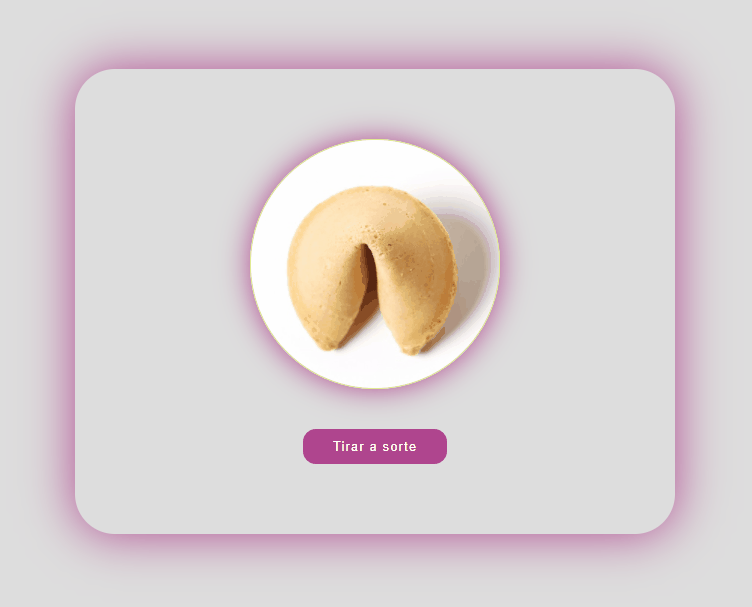

# Biscoito da sorte 

Projeto, que com clique do botão se comunica com outro componente do projeto, onde o mesmo escolhe uma frase da sorte que está armazenada em um ***Array*** e renderiza na tela a mensagem escolhida de forma aleatória


***Um Desafio para por em prática o que foi estudado até o momento em React, projeto utilizando Componentes de Classes, Componentes Funcionais , Comunicação entre Componentes, renderização de elementos, Estilização com *Sass/Scss,** Manipulação de Arrays, Funções em react, mais outras coisas de *React.Js***


### Visão do Projeto no modo Responsivo


##### Mobile

##### 


#### Desktop




### Estrutura do projeto 

- React.Js
- HTML5
- CSS3
- Sass / Scss


## Requisitos para rodar o projeto:

Instalar as dependências do React/ React script

```react
No Terminal e dentro da pasta raiz do projeto executar um dos comandos abaixo 
npm install react
    ou
yarn add react 
```


***Dev: Henrique Silva dos Santos***

***Desenvolvedor Web***

