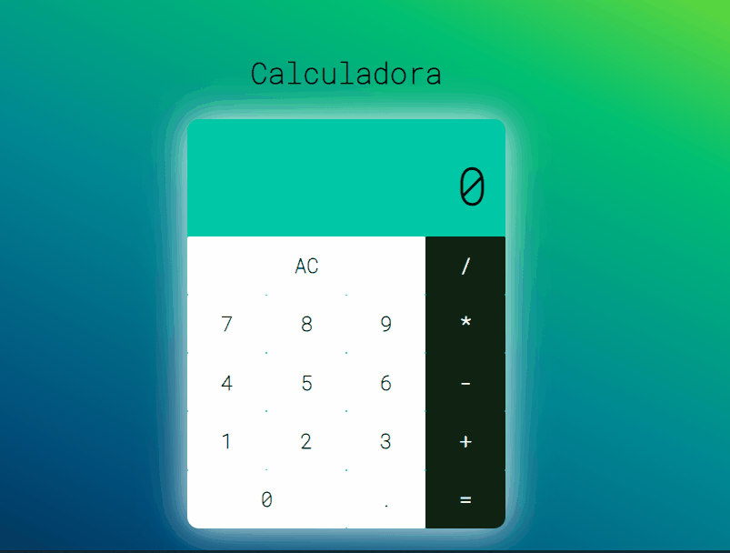

# Projeto Calculadora em React 

***Um Projeto do curso de web Moderno da Cod3r, porém no curso ele é feito em componentes de classe, eu como desafio peguei mais ou menos a ideia , implementei a lógica com algumas diferenças da original do curso, transformei os state de class em React Hook e fiz o projeto em componentes Funcionais, Mudei o layout os estilos da Calculadora de um jeito que achei que ficaria melhor e esse foi o resultado final*** 




## Estrutura do projeto

- React.js
- JavaScript
- Html
- Css
- SASS  |  SCSS

#### Requisitos para rodar o projeto

na pasta do projeto instalar o react 

```
npm install react
     ou 
yarn add react
```

Depois de finalizado a instalação rodar o comando 

```
npm start 
   ou
yarn start
```

Prontinho só´ usufruir do projeto  

***Dev: Henrique Silva dos Santos*** 

***Desenvolvedor web***
