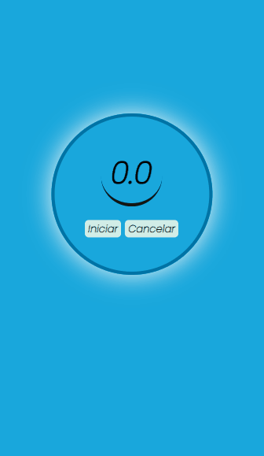
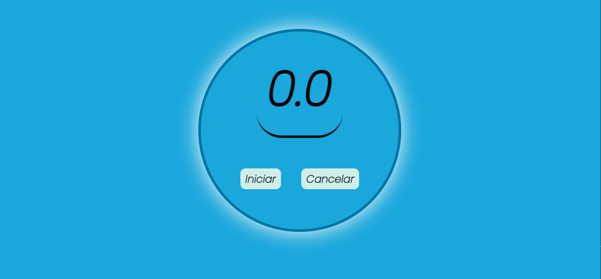

# Projeto cronometro Animado


***Mais um Desafio dos Estudos em React, um Cronometro com 2 botões: 1 que Inicia e depois de iniciado se torna em Pausa e um que Cancela/Desliga o Cronometro, projeto simples forçando a lógica com uso dos estados em React*** 


## Obs:

Animação parecendo um sorriso foi ideia minha como diferencial do projeto, feito com as propriedades border e border-radius do CSS3


### Visão do projeto


#### Mobile




#### Desktop




## Estrutura

- REACT
- HTML5
- SASS /SCSS
- CSS3


### Requisitos

##### Instalação do React no projeto

```react
Na pasta raiz do projeto abri o terminal e rodar o  seguinte comando 

npm install react
    ou 
yarn add react
```

Feito isso ainda no terminal rodar o comando para iniciar o projeto localmente

```react
npm start
 ou
yarn start
```


***Dev: Henrique Silva dos Santos***

***Desenvolvedor Web***